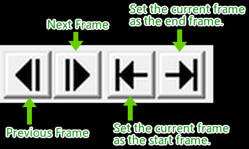
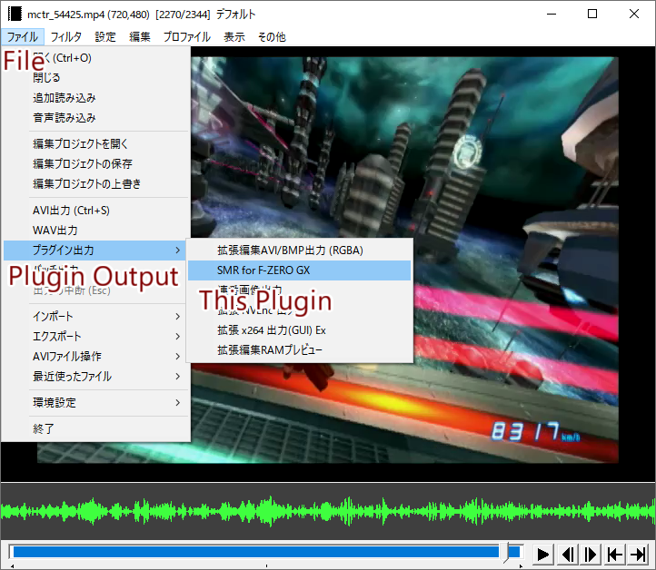
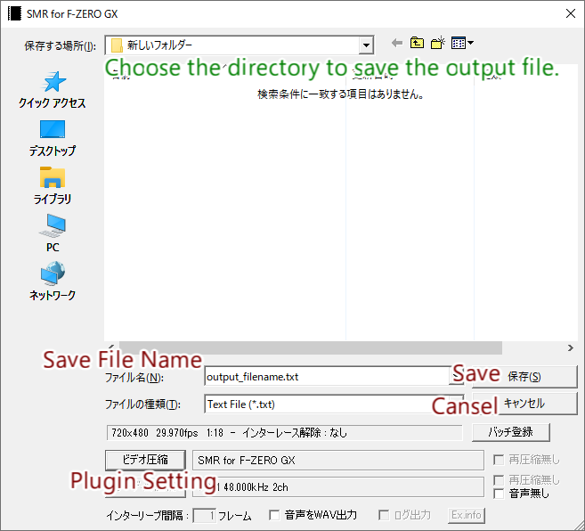
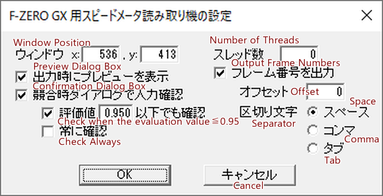
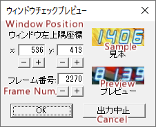
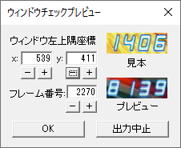
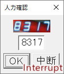
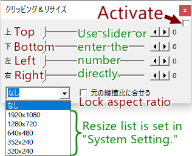

# Usage
This document provides a brief instruction to use "SMR for F-ZERO GX," an output plugin of AviUtl ExEdit2.

## AviUtl ExEdit2
AviUtl ExEdit2 is a video filtering tool for Windows. It is not so difficult to use "SMR for F-ZERO GX."

### Downloading and Installation
AviUtl ExEdit2 can be downloaded from http://spring-fragrance.mints.ne.jp/aviutl/.

AviUtl ExEdit2 is under development, so no stable version is available as of April, 2026. Using latest versions is recommended, but "SMR for F-ZERO GX" can be malfunction with untested version of AviUtl ExEdit2. Feel free to [open issues on GitHub](https://github.com/cycloawaodorin/fzgx_smr_ks/issues) when you find bugs or you have requests, questions.

Unzip the downloaded archive file or execute the installer for installation.

### Installing Plugins
Drag-and-drop the auo2 (output plugins), aui2 (input plugins), auf2 (filter plugins), aux2 (auxiliary plugins), au2pkg.zip (packaged archive) into the preview window of running AviUtl ExEdit2. The files will be installed into `%ProgramData%/aviutl2` directory.

### Opening Videos
Drag-and-drop the video file onto the `aviutl.exe` window. Without input plugins, AviUtl can only open AVI files. Thus, we recommend to install [L-SMASH Works](#l-smash-works) to open such as MP4 files.

### Setting Output Frame Range
Use slider or frame-by-frame move button to change the current frame. Set the start and end frames by buttons for that. The buttons are located at right-bottom of the aviutl.exe window. Frames before the start frame and frames after the end frame will not be output.

## Using SMR for F-ZERO GX
### Plugin Output
[Open a video file](#opening-videos), [set output frame range](#setting-output-frame-range), and then open the plugin output dialog box through "ファイル / File" > "プラグイン出力 / Plugin Output" > "SMR for F-ZERO GX."

Press "ビデオ圧縮 / Video Compression" button to open the plugin setting dialog box. After the setting, choose an output directory, input save file name, and then press "保存(S) / Save" button to start outputting.

### Setting Dialog Box
See the [Setting section of README.md](README.md#setting) for detail.

### Preview Dialog Box
See the [Preview dialog box section of README.md](README.md#preview) for detail.

In this case, (539, 411) is prefer to (536, 413).

### Confirmation Dialog Box
The confirmation dialog box will be shown when the [specified conditions](README.md#confirm) are met. Correct the displayed number and press "OK" button, or press "中断 / Interrupt" button to interrupt outputting.

### Resizing
If you want to extract speed values from videos other than 720x480 videos for 16:9 monitors, you need to resize before using this plugin. To resize videos on AviUtl, you can use "クリッピング&リサイズ / Clipping and Resize" built-in filter or [resize_ks](#resize_ks) plugin filter. To use these filters, open setting window through "設定 / Setting" > filter name, and check the right-top activation checkbox on the filter setting window. If you use resize filters, make sure that the resizing and window position are appropriate, by the [Preview Dialog Box](#preview-dialog-box).

![clipping_resize]./clipping_resize0.png)

## Recommended Plugins
### [L-SMASH Works](https://github.com/Mr-Ojii/L-SMASH-Works-Auto-Builds/releases/latest)
An input plugin which can read various video formats including MP4, MOV, QT, 3gp, 3g2, F4V and M4A. revXXX with largest XXX is recommended.

### [resize_ks](https://github.com/cycloawaodorin/resize_ks)
A filter plugin which can resize arbitrary resolutions.
